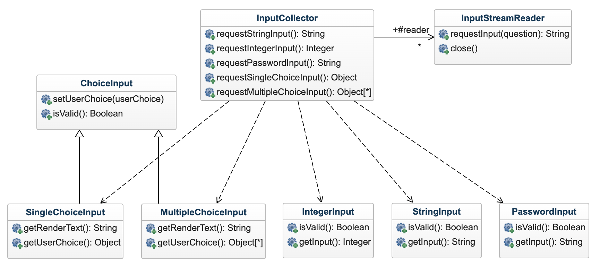
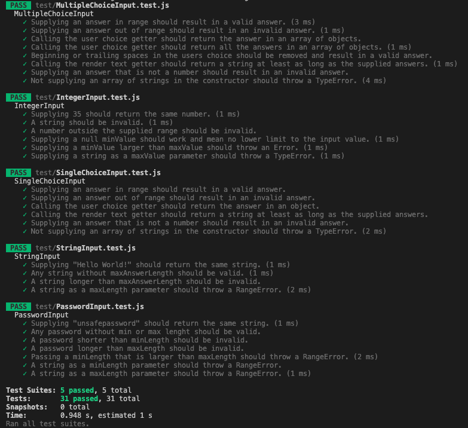

# Mall för inlämning laboration 1, 1dv610
​
## Checklista
  - [x] Jag har skrivit all kod och reflektioner själv. Jag har inte använt mig av andras kod för att lösa uppgiften.
  - [x] Mina testresultat är skrivna utifrån utförd testning ( och inte teoretiskt: "det bör fungera" :) )
  - [x] Koden är objektorienterad
  - [x] Jag har skrivit en modul som riktar sig till programmerare
​
## Egenskattning och mål
  - [ ] Jag är inte klar eftersom jag vet att jag saknar något. (Då skall du inte lämna in! Lämna då istället in på restlaboration.)
  - [x] Jag eftersträvar med denna inlämning godkänt betyg (E-D)
    - [x] De flesta testfall fungerar
    - [x] Koden är förberedd på Återanvändning
    - [x] All kod samt historik finns i git 
    - [x] Kodkvaliterskraven är ifyllda
    - [x] Reflektion är skriven utifrån bokens kapitel 
  - [x] Jag eftersträvar med denna inlämning högre betyg (C-B) och anser mig uppfylla alla extra krav för detta. 
    - [x] Samtliga testfall är skrivna    
    - [x] Testfall är automatiserade
    - [x] Det finns en tydlig beskrivning i hur modulen skall användas (i git)
    - [x] Kodkvalitetskraven är varierade 
  - [ ] Jag eftersträvar med denna inlämning högsta betyg (A) 
​
Förtydligande: Examinator kommer sätta betyg oberoende på vad ni anser. 
​
## Återanvändning
Modulen är uppbyggd på ett sådant vis att alla nödvändiga filer ligger under en och samma mapp, det enda användaren behöver göra är en enda import av default-exporten i, namngiven enligt standard, index.js-filen. Som en notis vill jag också säga att jag har tittat på hur man registrerar sin modul på npm. Så som min modul är byggd så anser jag, förutsatt att jag förstått rätt, att den är 100% anpassad för att väldigt enkelt kunna laddas upp på npm. Jag valde i slutändan att inte göra det eftersom mitt repo även innehåller mina personliga reflektioner som rör utbildningen.

Instruktioner för användning finns i [README.md](./README.md) under "Example usage" och "Installation".
​
## Beskrivning av min kod
Syftet med min modul är att användaren enkelt ska kunna ställa en fråga till slutanvändaren i terminalen, och begära in ett svar/input på den frågan. Modulen hanterar presentation av frågan, samt insamling och validering av svar/input.

Användaren kommer enbart använda sig av en instans av en enstaka klass (InputCollector) och dess metoder. Varje metod motsvarar att begära en viss typ av input från slutanvändaren (5 olika, se klass-diagram). Hela modulen är dock uppbyggd av totalt 8 klasser; 1 klass för interface, 1 klass som hanterar implementationen av input stream (input från slutanvändarens terminal), 5 klasser för olika typer av input samt 1 superklass som 2 av input-klasserna ärver från.

Baserat på ovanstående beskrivning så anser jag att funktionaliteten bakom varje metod i interfacet är självförklarande. Se de publika operationerna i InputCollector i diagrammet nedan.

​
## Hur jag testat
Modulen har testats genom automatiserade enhetstester skrivna med ramverket Jest. Manuella tester har såklart genomförts löpande under utveckling också.
​
### Testfall
Något som är viktigt att veta är att det finns en större brist i testningen av modulen, och det är att enhetstesterna testar klasserna som innehåller den stora majoriteten av logiken bakom modulen, men de testar inte de faktiska publika metoderna. De publika metoderna tillhandahåller strängar till de bakomliggande klasserna genom att läsa från input-stream, testerna tillhandahåller dessa strängar direkt till klasserna istället.

Även om detta inte är ett 100% korrekt test av "real world"-situationer så anser jag det bra nog inom ramen för kursen. Jag försökte under en lång tid få till möjligheten att "mocka" input, men lyckades inte få det att fungera. I en skarp situation med en riktig, kommersiell, produkt hade jag självklart inte nöjt mig med detta.

Jag anser ändå att nedanstående tester ger mer värde än manuella tester hade gett, då det hade inneburit mycket färre tester som tagit mycket längre tid att genomföra.

Nedanstående tester är alltså strukturerade efter de fem publika metoder som min modul tillhandahåller. Här simulerar jag att ge olika typer av input och testar förväntade resultat både vad gäller returvärden och validering.
​

​
​
## Kodkvalitetskrav
​
**Fetmarkera** de "regler" som används ur CC. Ni kan frångå tabellformat om ni vill. Skapa direktlänkar till er kod där det är lämpligt. Skriv så att jag kan förstå.
​
### Namngivning
​
| Namn och förklaring | Reflektion och regler från Clean Code |
|---------------------|---------------------------------------|
| **collector.requestStringInput()**   Metod för att begära input från användaren i form av en sträng. | 
**Use intention-revealing names**   Här har jag försökt vara tydlig, metoden begär input från användaren och returnerar resultatet. Det som kanske saknas är att retur-värdet inte är direkt uppenbart. 

 **Pick one word per concept**   Denna metoden (gäller samtliga metoder) hette från början `getStringInput` men jag valde att döpa om dem till `request...` istället. Främst för att inte blanda ihop beteendet med det vedertagna begreppet `getters`.
|
| **collector.requestIntegerInput()**   Metod för att begära input från användaren i form av ett heltal. | 
**Use solution domain names**   Även om begreppet `integer` inte existerar på det bokstavliga sättet i Javascript, så är det ändå vedertaget att betyda ett heltal, vilket jag med namnet antyder att man ska förvänta sig få tillbaka. 

 **Use pronouncable names**   Även om jag själv egentligen inte tycker det så skulle man kunna argumentera för att metodnamnen är relativt långa, det rättfärdigar jag med att de är väldigt läsbara. Ett alternativ i detta exempel skulle kunna vara `collector.reqIntInput()` men det är i min åsikt sämre, bl.a. av skälet "Use pronouncable names". 
 |
| **collector.requestPasswordInput()**   Metod för att begära dold input från användaren. | 
**Use intention-revealing names**   Här argumenterade jag med mig själv kring om jag skulle använda detta slutgiltiga metod-namnet, eller `requestHiddenInput()`. "Hidden" avslöjar mer kring metodens funktionalitet. Men, i slutändan så ansåg jag att det är ganska vedertaget att "password" ska döljas. "Password" skvallrar dessutom mer kring retur-värdet då en utvecklare bör förstå att detta kommer vara en sträng. 

 **Use searchable names**   Som en extra bonus av att använda regler nämnda ovan (intention-revealing och pronouncable names framför allt) är att namnen blir längre och i de flesta fall unika, vilket gör dem extremt sökbara. 
 |
| **collector.requestSingleChoiceInput()**   Metod för att begära *ett* svar från användaren utifrån en förbestämd lista av svar. | 
 **Add meaningful context**   Kanske en lite friare tolkning av denna regeln än vad boken tar upp. Men denna metoden är lite svårare att tolka än tidigare metodnamn, och då tycker jag att sammanhanget mellan metodnamnen från samma modul hjälper till. Då tidigare metoder har begärt svar i form av strängar eller heltal, så kan jag här förvänta mig något typ av svar tillbaka. 

 **Use problem domain names**   Då kommer vi osökt in på typen av input man begär. I detta fallet finns inga namn inom domänen "utveckling", men om man pratar formulär så är "single choice" och "multiple choice" vedertagna begrepp. |
| **collector.requestMultipleChoiceInput()**   Metod för att begära *ett eller flera* svar från användaren utifrån en förbestämd lista av svar. | 
 **Avoid mental mapping**   Tycker att samtliga metoder uppfyller detta krav, exakt vad det är man gör när man anropar metoderna står klart och tydligt i metodnamnet, man behöver inte "översätta" något när man läser koden. 

 **Don't add gratuitous context**   Denna känns egentligen ganska given, men jag tar med den som en bonus. Nej, min namngivning innehåller inte onödig extrainformation från dess sammanhang, tycker nog det är ganska rena namn utifrån dess syfte. 

#### Reflektion över Meaningful Names

*Observera att detta stycket med text inte var med i mallen för release.md, men enligt den ursprungliga instruktionen tolkade jag det som att den skulle finnas med, så det blir en bonus.*

Generellt sett, efter att ha läst kapitel 2 i boken, så inser jag att jag redan tidigare har jobbat efter många av dessa regler. Absolut inte alla, men för att jag själv ska ha lättare att komma tillbaka till min egen kod så har jag alltid försökt vara så tydlig som möjligt med min namngivning; EXAKT vad innehåller variabeln? Vad GÖR metoden?

Kapitel 2 har lärt mig mycket nytt och satt namn på vissa vanor jag redan hade. En reflektion som jag tidigt gjorde var att jag haft för vana att gärna förkorta mina variabelnamn. Exempelvis `averageCompletionTime` skulle kunnat bli `avgComplTime`, oftast för att jag tycker att långa varibelnamn gör koden svårare att läsa. I sig självt så kan det vara sant, men jag inser att när man fortsätter applicera regler som boken Clean Code rekommenderar, så blir de långa varibelnamnen inte ett problem utan snarare en tillgång. Långa varibelnamn kanske ser jobbiga ut i stora funktioner med blandad abstraktion, men om man istället fixar de underliggande problemen (alltså utbrytning av funktioner för att hålla abstraktionen på samma nivå) så blir de istället tydliga och funktionella.

En annan sak som jag definitivt gjort mig skyldig till är att bryta mot principen "make meaningful distinctions". Detta har jag gjort mig skyldig till, oftast i metoder med låg abstraktion där jag genomför beräkningar och bara vill lägga ett tillfälligt värde i en variabel till jag behöver den två rader senare. Då har det nog dykt upp en och annan `xOne` och `xTwo`.

Sammantaget extremt lärorikt! Än så länge så känns det som att denna boken är något som man bör komma tillbaka till då och då, bara för att få en påminnare.
​
### Funktioner

Observera att de längsta funktionerna/metoderna i min modul är väldigt lika varandra, jag har därför valt att hoppa över en del metoder i storleksordningen för att kunna göra lite mer varierade reflektioner.

| Metodnamn och länk eller kod | Antal rader | Reflektion |
|------------------------------|-------------|------------|
| **InputStreamReader.requestInput(question)**   [Länk till kod](./src/InputStreamReader.js) - rad 36 | 15 | 
 **Small!**   Blev faktiskt själv förvånad när jag kom tillbaka till den här metoden i efterhand. 15 rader är ganska mycket hur man än vrider på det, här har jag t.o.m. lyckats deklarera en ny funktion inuti metoden vilket direkt bryter mot riktlinjen att inte ha nästlade strukturer i metoderna. Det hade jag lätt kunnat lösa genom att deklarera denna funktionen som en privat metod i klassen istället för att nästla. 

 **Command query separation**   Trots metodens längd så följer jag ändå denna principen anser jag. Metoden gör något, d.v.s. begär input från användaren. Generellt sett anser jag nog att jag i modulen varit ganska duktig på att använda denna principen. Ett generellt användande av `is`och `get`är exempel på det. |
| **InputCollector.requestMultipleChoiceInput(question, choices)**   [Länk till kod](./src/InputCollector.js) - rad 125 | 8 | 
 **Don't repeat yourself**   Något som jag anser att jag i normala fall är bra på, så det stör mig lite när jag går tillbaka och reflekterar att jag här har brytit mot det ganska grovt. Varje metod i klassen gör en validitetskoll, och returnerar sedan resultatet alternativt kastar ett undantag. Detta hade jag helt klart kunna abstrahera bort. 

 **One level of abstraction per function**   Den här regeln tycker jag generellt sett är svår, speciellt metoder som ligger högre upp i strukturen och då bör ha en hög abstraktionsnivå. Här blandar jag i alla fall tydligt abstraktionsnivåer då jag jobbar både med mina egna metoder och kastar undantag i en och samma metod. Som nämnt ovan så skulle jag kunnat bryta ut hanteringen av undantag till en egen privat metod. 
 |
| **InputCollector.requestIntegerInput(question, minValue = null, maxValue = null)**   [Länk till kod](./src/InputCollector.js) - rad 59 | 7 | 
 **Arguments - Triads**   Den här metoden tar tre argument, vilket är mer än nödvändigt. Såhär i efterhand så hade jag nog istället valt att göra om metoden till att ta två argument; `question` och `options` där options då är ett options-objekt där man kan skicka med nycklar för `minValue` och `maxValue` istället. 

 **Verbs and Keywords**   Anser att jag här följer regeln ganska väl. "request integer input" är definitivt ett verb och "question" är substantivet. Tycker nog att det är ganska tydligt hur de förhåller sig till varandra. 
 |
| **ChoiceInput.validateUserChoice(choice)**   [Länk till kod](./src/ChoiceInput.js) - rad 101 | 6 | 
 **Do one thing**   Den här metoden tycker jag har ETT väldigt tydligt syfte. Den validerar användarens val, returnerar true om valet är validerat och false om inte. 

 **Structured Programming**   Denna regeln i sig diskuteras också av boken, alltså hur man ska förhålla sig till den. Personligen så håller jag med bokens ståndpunkt. Detta är en väldigt liten metod med ett syfte, därför tycker jag att det är ok, och faktiskt effektiv programmering, att jobba med "early returns". Om valideringen misslyckas redan på första kontrollsatsen, vad är då meningen med att köra den andra? Det slutgiltiga resultatet är ändå redan klart. 
 |
| **InputStreamReader.constructor(hideInput = false)**   [Länk till kod](./src/InputStreamReader.js) - rad 22 | 5 | 
 **Flag arguments**   När jag först skrev den här metoden tyckte jag ändå att jag hade löst problemet med att byta mellan dold och öppen input i terminalen på ett elegant sätt. Mitt mod sjönk dock något när jag läste "Flag arguments" delen i boken, men såhär i efterhand förstår jag absolut nackdelen, framför allt för användaren. Detta hade jag istället lätt kunnat lösa genom att lägga till ytterligare en metod `requestHiddenInput()` jämsides den redan existerande `requestInput()`.
​
## Laborationsreflektion

Som nämnt tidigare så har de första kapitlena i boken varit extremt lärorika. Jag har lärt mig att jag redan tidigare använt en hel del principer från boken hyffsat väl; exempelvis "intention revealing names" och "searchable names". Detta då jag har tyckt att det underlättar för mig själv när jag sitter och utvecklar. Att ha namn på principerna underlättar ytterligare och ger mig en chans att vidareutvecklas ännu mer.

Det som jag personligen tycker är svårast och där jag har en del att jobba på är principerna kring funktioner. Framför allt vad det gäller abstraktionsnivåer (one level of abstractions) och längden på funktioner (small). Det är extremt lätt, och något som man gör ofta, att bara slänga in en enstaka kodrad eftersom "det är ju ändå här jag gör x eller y, då kan jag lika gärna göra z också", vilket osökt för mig in på "do one thing". Stycket i boken kring att funktioner som börjar med att man initierar variabler utan att deklarera dem är ett varningstecken träffade väldigt "nära hjärtat". Det är ett beteende jag verkligen känner igen.

Just abstraktion är också något som pratas väldigt mycket om, men som jag personligen haft svårt att greppa tidigare (tillsammans med många andra gissar jag). Den mer praktiska approachen kring att separera användandet av dina egna metoder (högnivå abstraktion) från lägre nivåer av abstraktion som inbyggda metoder och primitiva datatyper tycker jag är lättare att ta till sig och lättare att greppa. Det är definitivt ett tankesätt som jag kommer ta med mig.

Något annat som jag absolut kommer ta med mig är att vara lite mer snäll mot sig själv. Verktygen i boken Clean Code är jättebra och om man har en grundläggande förståelse för det så tror jag att man kan bygga tidiga iterationer av kod som har bra struktur. Men det kommer också innebära att refaktorisering i kommande iterationer blir lättare. Med andra ord ska jag försöka få välstrukturerad, fungerande, kod till en början. Men att sedan refaktorisera till mindre funktioner med bättre abstraktion för att öka läsbarheten blir då lättare, eftersom grunden lade förutsättningarna för det.

Sammanfattningsvis, kul ämne! Ser fram emot att skriva kod som gör andra utvecklare gladare ;)